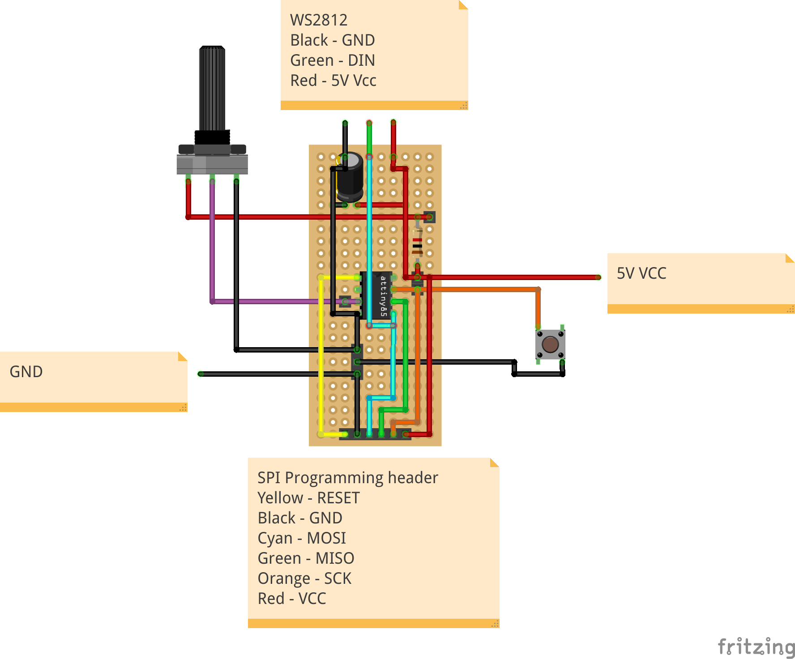

<!-- omit in toc -->
# Not-so-Tiny Dimmer 

What initaly just started as minimalist ATtiny based WS2812 LED strip dimmer, quickly turned into a cheap and feature rich ATtiny based WS2812 strip controller with single color, multi color and animation support.

## Contents
- [Contents](#contents)
- [Features](#features)
  - [Patch bank](#patch-bank)
  - [Hardware](#hardware)
- [Hardware](#hardware-1)
  - [Schematic](#schematic)
  - [Perfboard](#perfboard)
  - [Showcase](#showcase)
- [Flashing the firmware](#flashing-the-firmware)
- [Project log](#project-log)

## Features

The Not-so-Tiny dimmer is a open source ATtiny Based WS2812 strip controller that offers support for single and multi color lights, as well various animations.

### Patch bank
The controller offers a patch bank with up to 10 patches, where each patch slot can be assigned in the [configuration header](src/config.h) to something as simple as projecting a single color across the strip, all the way to projecting flashy rainbow animations. If less than 10 patches are desired, the `NUM_PATCHES` directive can be reduced in the [configuration header](src/config.h).

**Please note, that required ammount of program flash rises with the number and complexity of patches. Thus, the use of an ATtiny25 is likely to only be limited to the use of a few single color patches.**

Due to the fact that patches are implemented C preprocessor directives, the increasing the maximum number of patches requires addition of case statements in the [update_strip](https://github.com/CTXz/Tiny-Dimmer/blob/master/src/main.c#L193) function, along with a change of the `NUM_PATCHES` directive.

### Hardware

To navigate trough the patch bank, a single push button is provided. Once the last patch has been reached, the first patch is loaded again upon button press.

Many patches also offer a tweakable parameter, such as brightness and speed control. A potentiometer is used to adjust these parameters in real time.

To compensate for sloppy hardware jobs, the firmware also comes with potentiometer and push button noise reduction to reduce LED flicker and false color toggling. It should be noted however, that these features cost program flash and runtime cycles and can be adjusted or disabled in the [configuration header](src/config.h)

The controller firmware has been written for and ATtiny85 chips, but will tightly fit onto a ATtiny25 chip if fewer and minimal patches are used. Unless the controller is planned to be used as a simple single-color WS2812 RGB dimmer, it is really recommended to at least use an ATiny45, preferably an ATiny85 if one wants make full use of all features.

## Hardware

The following components are required to build a Not-so-Tiny dimmer:

|Component|Quantity|Description|
|---------|--------|-----------|
|WS2812 strip|1|The controller drives addressable WS2812 RGB strips, as those are simply very common and are what I had at home.|
|ATtiny 85/45/25|1|The chip that runs the firmware, hence the name "Tiny" in the name. Although the firmware will barely fit on a ATtiny25, it is highly recommended to use an ATiny45 or ATiny85 if additional features are to be added to the software later.|
|1K resistor|1|Used to limit the current to prevent the brightness pot from burning trough.|
|10k linear potentiometer|1|Used to set the brightness. 10k linear pots are recommended, but any linear pot between 1k and 100k should do the job.|
|10uF Capacitor|1|Optional, but helps decoupling power supply noise.|
|Push Button|1|Used to toggle between colors and to activate fading.|
|1x6 2.54mm Female header|1|Exposes a SPI header to program the MCU.|
|Proto Perfboard|1|In the perfboard layout below I've used a 10x24 Perfboard, however much less is required.|

The controller can also be easily be built with a digispark board.

The price for the components can range anywhere between 5 to 15 EUR, depending from where you purchase the components, and what their quality is.

### Schematic

### Perfboard

Top view:

### Showcase

Perfboard:

Programming via SPI with ArduinoISP:

## Flashing the firmware

Flashing the firmware is possible even with the chips attached to the board. Hence it is recommended to solder an SPI header onto the board if you're planning to update the software and do not wish to open up the device for every firmware update.

To flash the firmware, an SPI programmer is required. Since I still have a few spare Arduino's lying around, I decided to use an Arduino Leonardo with the [Arduino ISP firmware](https://www.arduino.cc/en/tutorial/arduinoISP) installed to program the controller.

Since the firmware has been written in [PlatformIO](https://platformio.org/), it is easiest to download the IDE, simply import the project and flash it from there.

Should your Not-so-Tiny dimmer not use an ATtiny85, you must change the `board` directive in the [PlatformIO configuration file](platformio.ini) to your ATtiny model.   

In addition to that, the [PlatformIO configuration file](platformio.ini) also expects a stk500v1 programmer (compatible with Arduino over ISP). If you are not programming the controller via an Arduino, you must change `upload_protocol` to the the corresponding programmer in the configuration file (See the [PlatformIO atemlavr documentation](https://docs.platformio.org/en/latest/platforms/atmelavr.html)).

Once everything is set in PlatformIO, make sure the parameters in the [configuration header](src/config.h) match your needs and simply click the upload button. The firmware should be flashed onto your controller in no time. 

If you're planning to flash the firmware without the PlatformIO IDE, **make sure to program the ATtiny's fuses for it to run at 16Mhz!**

## Project log

The Tiny dimmer was built mostly out of necessity for a kitchen light and quarantine boredom. The choice of components was initially more or less a result of the limited number of spare parts that I had lying around at home. In particular, I had a digispark with an ATtiny25 soldered onto it, which I figured could suffice for a simple kitchen light.
Working with 2 KB of program flash and 128 B of RAM certainly came with its challenges. The tiny amount of program memory put the use of the Arduino library and the common NeoPixelBus library completely out of question and I was forced to write the code in pure AVR C.

To drive the WS2812 strip I decided to give [cpldcpu's light_ws2812](https://github.com/cpldcpu/light_ws2812) library a shot, which I had essentially stripped down to the `ws2812_sendarray_mask` function. Since my plan was to control all pixels of the strip simultaneously (yes, I'm aware I could've used non addressable strips for that, but WS2812 strips are all I have lying around... besides they just need one pin to be driven), I had to find a way to alter the `ws2812_sendarray_mask` function to no longer accept a pixel buffer, which wastes an enormous amount of RAM, but rather a RGB object which it would apply to all LEDs.

Easier said than done, as the function is incredibly time sensitive. That's the  reason as to why the `ws2812_sendarray_mask` function's main loop, which transmits the color data to the strip, has been written in AVR assembly (unfortunately a assembly languages that I'm still very unfamiliar with). Applying the slightest changes always ended up breaking the function, until I figured that the compiler optimization might be the reason behind that. Turns out, by turning the compiler optimization using the `#pragma GCC pop_options` macro, the main loop becomes allot less sensitive to changes. I haven't taken a look at the pulse time differences that arise with and without optimization enabled, but it might be something interesting to look into. Never the less, I was happy that I could finally control the WS2812 strip as desired, without blowing away the ATtinys 128 B of RAM, and thus I rewrote the `ws2812_send_array` function to `ws2812_set_all` which sets all pixels to a provided RGB value.

From here, implementing the firmware was rather straight forward. Initially I planned to assign the push button an INT0 interrupt. However, after implementing button hold detection and noise reduction, support for interrupts has been dropped in favour of a pure state polling implementation.

Adding the fade animation was a little tricky in that its maximum speed, provided its best resolution, was heavily limited by the speed of the `ws2812_set_all` function. Hence, for faster fading speeds, I was forced to increase the step size for the colors, meaning faster fading speeds come at the cost of smoothness/resolution.

All in all, this was a fun project to kill some quarantine time and most importantly, I'm more than happy with the way the result turned out and it was nice to put my AVR C skills to use again. Sure, I could've bought a cheap chinese LED strip controller, but where's the fun in that. This controller is all about open source and allows me to extend its features by reprogramming it. If I ever plan on discarding it, I can simply pop out and desolder all components are reuse them for another project.

--- Update ---

I have since reworked the software quite a bit. The ws2812 functions have been reduced to a set of 4 core functions, `ws2812_prep_tx()`, `ws2812_wait_rst()`, `ws2812_tx_byte()`, `ws2812_end_tx()`. With these functions I have then implemented a hardware abstraction layer in the [strip.c](src/strip.c) file, which defines various routines to control the LED strip. Patches have been completely reworked and are now defined in the [configuration header](src/config.h) using macros provided by the [patch_macros.h](src/patch_macros.h) header file. Using macros allows for very flexible patches that aren't limited to a single function or some sort of array of a specific data type. This made room for the easy implementation of animations.

--- Update ---

I think it's time to admit that this project is no longer a minimal dimmer, in fact, it has become quite the opposite and is turning into a feature bloated over-engineered ATtiny based WS2812 controller that, at least if the quarantine boredom won't end soon, will be connected, and will require connection, to the world wide web, feature the clunkiest most inaccurate and unnecessary voice control, feature incredibly water and dust sensitive touch controls and some form of AI or who knows what the future offers.

In all seriousness, except for the fact that I've now renamed the project to Not-so-Tiny dimmer, the device can now be more accurately considered a LED strip controller. While I personally do take large joy in adding and using the additional flashy animations, I've taken into account that we're starting to cross the RGB hell border in the eyes of many people, and have hence made sure that the software architecture is very flexible and allows one to take full control of which features and patches to be implemented. Hell, if desired, the controller software can be reduced to only support simple single color light with brightness control.